<!-- ═══════════════════════════════════════════════════════════
     HEADER / HERO SECTION
     ─────────────────────
     First thing visitors see. Must answer: Who are you? What do you do?
     The <h1> is treated like a page title by Google — make it keyword-rich.
     ═══════════════════════════════════════════════════════════ -->

  <!-- OPTION A: Use a custom banner (recommended — design one on Canva.com)
       Replace the URL below with your own image hosted in this repo or on Imgur.
       Set alt="" to include your name + role for SEO. -->
  <!--  -->

  # Hi, I'm Sahil Akoliya 👋
  ### Mobile & Web Developer · Freelance Developer · Scrum Master

  <!-- SEO TIP: The H3 above contains your role keyword + "Freelance Developer" —
       two of the most searched phrases for hiring on GitHub. -->

  <!-- VISITOR COUNTER — shows social proof, signals activity to search engines -->
  

  <!-- SOCIAL BADGES — also act as navigation links in Google search results -->
  
  
  
  

  <!-- AVAILABILITY BADGE — the single most important signal for freelance clients -->
  

---

<!-- ═══════════════════════════════════════════════════════════
     ABOUT ME
     ─────────────────────
     Write naturally. Include: what you build, who you build it for,
     and your location (helps local SEO for freelance discovery).
     ═══════════════════════════════════════════════════════════ -->

## 🧑💻 About Me

I'm a **Mobile & Web Developer** based in **Surat, India**, with **2.5+ years of experience** building fast, scalable mobile and web applications for startups and small businesses.

<!-- PERSONALIZE THIS PARAGRAPH — don't leave it generic. -->
- 🚀 Currently working on **Stock Market App**
- 💼 Open to **freelance projects**, **collaborations**, and **contract work**
- 🌱 Currently exploring **React Native and advanced Flutter architecture**
- 💬 Ask me about **Flutter, React, Next.js, Node.js, MongoDB**
- ⚡ Fun fact: **I am a quick learner and can pick up new technologies quickly**

> **"I build fast, scalable web applications for startups and small businesses"**

---

<!-- ═══════════════════════════════════════════════════════════
     TECH STACK
     ─────────────────────
     Use shield.io badges. These render as images but their alt text
     is keyword-rich (e.g. "React" "Node.js") which Google picks up.
     Only list technologies you're actually proficient in.

     Find more badges at: https://shields.io or https://github.com/alexandresanlim/Badges4-README.md-Profile
     ═══════════════════════════════════════════════════════════ -->

## 🛠️ Tech Stack & Tools

<!-- LANGUAGES -->
**Languages**

<!-- ADD OR REMOVE LANGUAGE BADGES AS NEEDED -->

<!-- FRAMEWORKS & LIBRARIES -->
**Frameworks & Libraries**

<!-- ADD OR REMOVE FRAMEWORK BADGES AS NEEDED -->

<!-- DATABASES -->
**Databases**

<!-- ADD OR REMOVE DATABASE BADGES AS NEEDED -->

<!-- DEVOPS & TOOLS -->
**DevOps & Tools**

<!-- ADD OR REMOVE TOOL BADGES AS NEEDED -->

---

<!-- ═══════════════════════════════════════════════════════════
     FEATURED PROJECTS
     ─────────────────────
     This is your portfolio section. Pin your 3 best projects.
     Each project entry should answer: What does it do? What tech?
     Where can I see it live / in action?

     Link each project to its repo — internal GitHub links help
     GitHub's own search algorithm connect your profile to those repos.
     ═══════════════════════════════════════════════════════════ -->

## 🚀 Featured Projects

<!-- PROJECT 1 -->
### 🔹 [PROJECT NAME 1](https://github.com/[YOUR_USERNAME]/[REPO-NAME-1])
> **[One-line description of what this project does and who it's for]**

[2–3 sentences about this project. What problem does it solve? What makes it interesting or technically impressive? What was your role if it was collaborative?]

**Tech used:** `[Tech 1]` `[Tech 2]` `[Tech 3]`

---

<!-- PROJECT 2 -->
### 🔹 [PROJECT NAME 2](https://github.com/[YOUR_USERNAME]/[REPO-NAME-2])
> **[One-line description of what this project does and who it's for]**

[2–3 sentences about this project.]

**Tech used:** `[Tech 1]` `[Tech 2]` `[Tech 3]`

---

<!-- PROJECT 3 -->
### 🔹 [PROJECT NAME 3](https://github.com/[YOUR_USERNAME]/[REPO-NAME-3])
> **[One-line description of what this project does and who it's for]**

[2–3 sentences about this project.]

**Tech used:** `[Tech 1]` `[Tech 2]` `[Tech 3]`

---

<!-- ═══════════════════════════════════════════════════════════
     GITHUB STATS
     ─────────────────────
     Dynamic widgets from github-readme-stats (free, no API key needed).
     Replace [YOUR_USERNAME] with your actual GitHub username.
     Theme options: dark, radical, merko, gruvbox, tokyonight, onedark,
                    cobalt, synthwave, highcontrast, dracula
     Full docs: https://github.com/anuraghazra/github-readme-stats
     ═══════════════════════════════════════════════════════════ -->

## 📊 GitHub Stats

  
  
   
  

---

<!-- ═══════════════════════════════════════════════════════════
     WORK WITH ME (FREELANCE CTA)
     ─────────────────────
     The most important section for freelancers. Be direct and specific.
     Recruiters and clients scan fast — make the CTA unmissable.
     ═══════════════════════════════════════════════════════════ -->

## 💼 Work With Me

I'm currently **available for freelance projects** and open to exciting opportunities. I enjoy working on:

- ✅ Cross-platform mobile apps with **Flutter / React Native** (Android & iOS)
- ✅ Web apps and dashboards with **React / Next.js**
- ✅ REST APIs and backends with **Node.js, MongoDB, Supabase & Firebase**
- ✅ Turning **Figma designs into production-ready apps**, from MVP to launch

**Preferred engagement:** Remote · Contract · Project-based

📩 **Best way to reach me:** sahilakoliya.dev@gmail.com | https://linkedin.com/in/sahilakoliya

---

<!-- ═══════════════════════════════════════════════════════════
     CONTRIBUTION GRAPH (OPTIONAL — VISUAL FLAIR)
     ─────────────────────
     The snake animation is well-known and makes profiles memorable.
     Setup guide in the companion SETUP_GUIDE below.
     ═══════════════════════════════════════════════════════════ -->

## 🐍 Contribution Graph

  <picture>
    <source media="(prefers-color-scheme: dark)" srcset="https://raw.githubusercontent.com/SahilAkoliya-Dev/SahilAkoliya-Dev/output/github-contribution-grid-snake-dark.svg" />
    <source media="(prefers-color-scheme: light)" srcset="https://raw.githubusercontent.com/SahilAkoliya-Dev/SahilAkoliya-Dev/output/github-contribution-grid-snake.svg" />
    
  </picture>

---

<!-- ═══════════════════════════════════════════════════════════
     CONNECT / FOOTER
     ═══════════════════════════════════════════════════════════ -->

## 🤝 Let's Connect

<!-- OPTIONAL: Upwork / Fiverr / Toptal badge if applicable -->
<!--  -->

 

⭐ **If you find my work helpful, consider starring my repos — it helps others discover them!**

